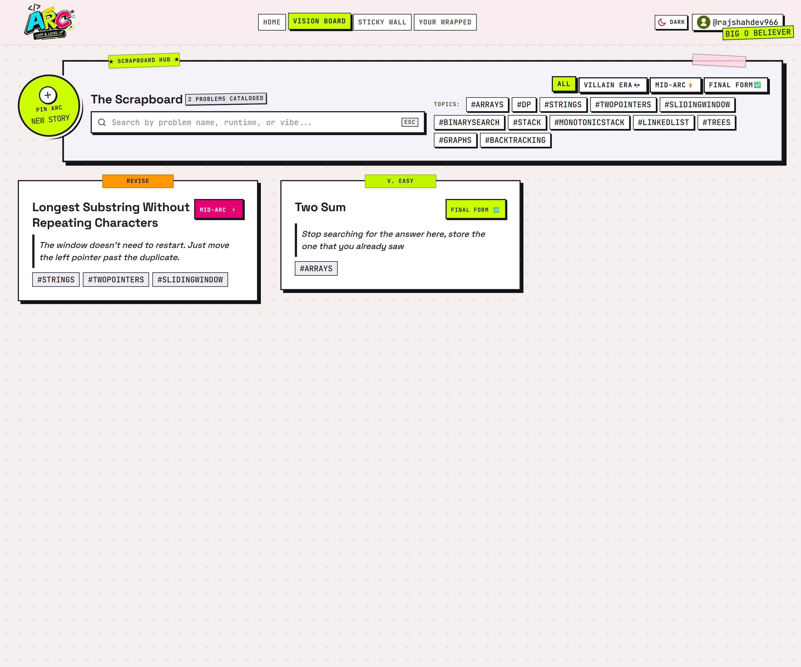
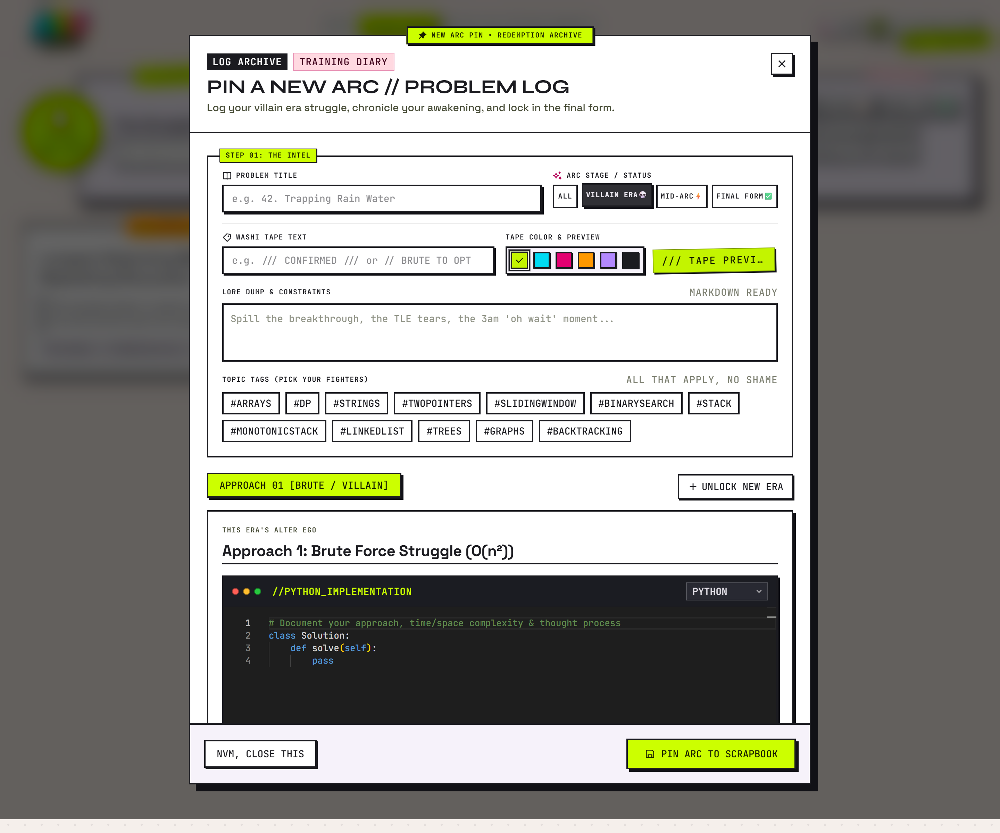
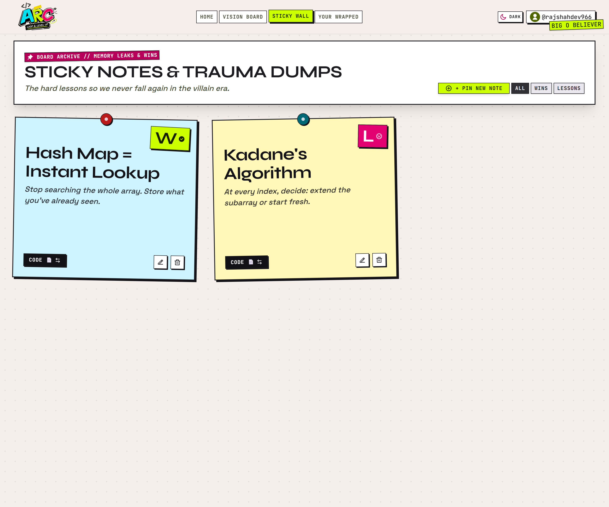
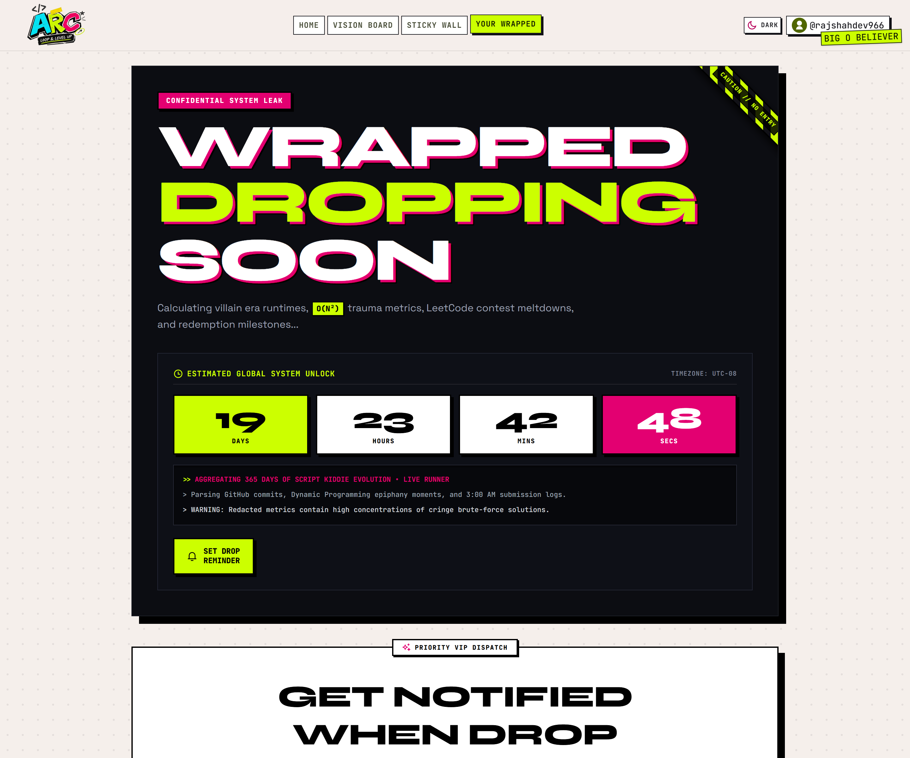

<div align="center">

# ⚡ ARC
### *the DSA glow-up log, disguised as a scrapbook*

`STATUS: FINAL FORM` · `DIFFICULTY: VILLAIN-TIER` · `PATTERNS: 6+` · `VIBES: IMMACULATE`


<div align="center">

[](https://arc-loop-level-up.vercel.app/)

</div>

</div>

---

## 📌 Pinned to the top of the board

This isn't a project readme. It's a **Problem Card** — the same format ARC uses for every DSA problem you log inside the app. Brute force first, optimized solution second, complexity analysis at the end. Read it like you'd read your own arc.

```
PROBLEM:      "DSA interview prep culture, as it currently exists"
DIFFICULTY:   Villain-tier
CONSTRAINTS:  300,000+ CS grads a year, one grind, zero narrative
TAGS:         #Burnout #ToolingFatigue #WeAllDidThis
```

---

## 💀 Approach 01 — Brute Force *(what everyone already tries)*

Every CS student runs the same nested loop of tools that were never built for this job:

- **LeetCode / HackerRank** — treats mastery as a binary. `Accepted` or `Failed`. No memory of the three attempts it took to get there.
- **Notion / Excel / a folder of `.txt` files** — sterile productivity tools borrowed from corporate memos, repurposed to hold the messiest, most emotional part of becoming an engineer.
- **Your own brain** — trying to remember *why* the hashmap worked, four days and 40 problems later.

**Time Complexity:** O(burnout)
**Space Complexity:** O(1) — because nothing you learn actually sticks around.

This approach passes the tests. It does not pass the vibe check.

---

## ✅ Approach 02 — Optimized *(this is ARC)*

The insight: the real story was never "solved" vs. "unsolved." It was **Villain Era → Mid-Arc → Final Form** — and nobody was writing that part down.

ARC is a neo-brutalist, cyber-scrapbook developer OS built to log *that* journey instead of throwing it away. Here's every module, broken down like its own sub-problem:

<br>

### 🪪 `features/auth` — Developer Persona Onboarding
No sterile login form. You claim an `@dev_handle` and pick a coding archetype (`Speed Demon`, `Bug Magnet`, `LeetCode Monk`, `10x Engineer`) before you ever touch a problem. Onboarding as identity, not paperwork — guarded end-to-end by Redux-backed route protection so nobody stumbles into a board that isn't theirs.

### 📌 The Vision Board — Mission Control
Your problems, pinned like a corkboard instead of buried in a spreadsheet row. Real-time, cross-filterable by **stage** (Villain Era / Mid-Arc / Final Form) and **topic tag** (Graphs, DP, Backtracking, and the rest) at the same time — no page reload, no stale state. Every card wears its own washi tape, at its own angle, because two problems solved the same day should not look identical.

### 🧪 The Arc Modal — Approach Studio
The crown jewel. Instead of overwriting your code every time you improve it, `useFieldArray` lets you stack **Approach 01, Approach 02, Approach 03…** side by side — Brute Force, Memoized DFS, Tabulation, whatever your actual path looked like — each with its own Monaco editor, its own language, its own notes on what changed. Nothing gets erased on the way to optimal. The struggle is the receipt.

### 🗒️ The 3D Sticky Wall — Pattern Memory
Hardware-accelerated flip cards (`preserve-3d`, `rotateY(180deg)`) for the fast stuff — the "wait, THAT'S why two pointers works" moments you'd otherwise lose in a Discord DM to yourself. Front: the pattern. Back: the gotcha. Color-coded, dark-mode-locked so the paper always looks like paper.

### 🎁 Your Wrapped — The Annual Dossier
Spotify Wrapped, but it's your `O(N²)` era getting turned into a shareable flex instead of a memory you'd rather not revisit. Persistent countdown, zero timer drift, built to be screenshotted.

### 🎢 The Glow-Up Carousel — Before/After, On Demand
Swipe through your own evolution on a single problem — brute force to final form — the same way you'd flip through a camera roll, not a diff view.

<br>

**Time Complexity:** O(actually remembering what you learned)
**Space Complexity:** O(n) — where n is how many arcs you've got the guts to pin.

---

## 🎨 Design DNA

ARC rejects the beige SaaS dashboard on purpose. The whole interface runs on one rule: **if it doesn't look like it was physically pinned, taped, or stamped onto a desk, it doesn't belong.**

| Token | Value | Where it shows up |
|---|---|---|
| Ink | `#111116` | Every border, every hard shadow |
| Acid Lime | `#CCFF00` | Primary actions, "final form" states |
| Hot Pink | `#FF2A85` | Alerts, villain-era tags, emotional spikes |
| Cyber Cyan | `#00E5FF` | Topic tags, links |
| Display type | `Syne` | Headlines that need to shout |
| Body type | `Space Grotesk` | Everything you actually read |
| Code type | `JetBrains Mono` | Editors, complexity tags, terminal logs |

No soft glassmorphism. No blurred shadows. No pastel gradients. Every drop shadow is a hard, flat offset — because stickers don't have ambient occlusion.

---

## 📸 Pin the evidence

*Screenshots go here — drag them into `/docs/screenshots/` and swap the paths below. Caption each one like a Polaroid, not a figure label.*

<div align="center">

| | |
|---|---|
|  <br> `"the corkboard, not the spreadsheet"` |  <br> `"three approaches, zero deleted history"` |
|  <br> `"the wall that remembers two-pointers for you"` |  <br> `"villain era, now shareable"` |

</div>

---

## 🔓 What unlocks next *(a roadmap with an XP bar, not a wishlist)*

ARC's next chapters aren't a fixed date — they're gated behind the only metric that's ever mattered here: **people actually using it.** Here's what unlocks at each tier.

```
[■■■■■■■■■■] TIER 0 — SHIPPED
  ✓ Vision Board, Arc Modal, Sticky Wall, Your Wrapped, Glow-Up Carousel

[■■■□□□□□□□] TIER 1 — UNLOCKS AT REAL USERS
  → LeetCode + GitHub OAuth sync — auto-ingest solved problems, runtimes,
    and memory percentiles straight into the Vision Board
  → Automatic GitHub backup — every arc exported as clean Markdown to
    your own repo, no copy-pasting

[□□□□□□□□□□] TIER 2 — UNLOCKS AT A REAL COMMUNITY
  → Forkable arcs — fork someone else's approach, attach your own
    benchmark, annotate their edge cases inline in Monaco
  → Arc Score — a rating that rewards documenting multiple approaches,
    not just brute-forcing your way to a green checkmark
  → Guild / university leaderboards — cohort-based prep, not solo grind

[□□□□□□□□□□] TIER 3 — UNLOCKS AT SCALE
  → Arc Live — real-time collaborative rooms for live DSA/system-design
    breakdowns, dual-pane Monaco so you code alongside the presenter
  → Fully automated "Wrapped Up" — monthly + annual dossiers generated
    with zero manual assembly: villain eras conquered, hardest problem
    broken down, peak grinding hours, the whole heatmap
```

No tier ships before the one before it earns its keep. That's the whole roadmap philosophy — same as the product itself: **prove the approach works before you call it optimized.**

---

## 💻 Run it locally

```bash
# clone it
git clone https://github.com/your-username/arc-dsa-glowup.git
cd arc-dsa-glowup/Arc

# install
npm install

# run it
npm run dev
# → http://localhost:5173

# ship it
npm run build
npm run preview
```

**Requires:** Node `>= 18.0.0`, npm `>= 9.0.0`

---

## 🛠️ Complexity analysis *(the actual tech stack)*

| Layer | Tech | Why |
|---|---|---|
| Core | React 19 + Vite 7 | Fast HMR, concurrent-ready, no bloat |
| State | Redux Toolkit + Context | Redux for auth/session, Context for isolated boards |
| Styling | Tailwind CSS v4 | Native `@theme` tokens, no config sprawl |
| Forms | React Hook Form | `useFieldArray` powers the whole multi-approach engine |
| Code editor | `@monaco-editor/react` | Real IDE, not a `<textarea>` cosplaying as one |
| Icons | `@remixicon/react` | Clean neo-grotesque vector set |
| Fonts | Google Fonts | Syne / Space Grotesk / JetBrains Mono |

---

## 🧑‍💻 The Architect

<div align="left">


**Find the human behind the villain-era commits:**

- GitHub — [@rajshahdev966](https://github.com/rajshahdev966)
- LinkedIn — [Raj Shah](https://www.linkedin.com/in/rajshah-dev/)


</div>

---

<div align="center">

> — RAJ SHAH'S ARC COMMITTEE 

**⭐ Star this if your own arc started in villain era too.**

</div>